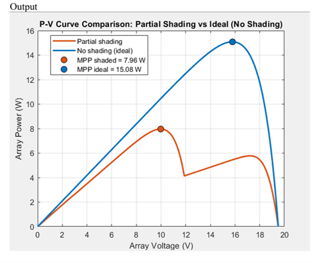
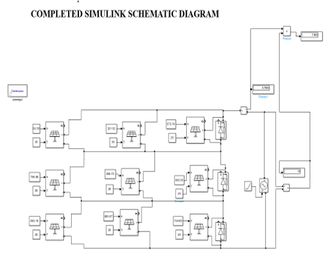

# Intelligent PV Array Under Partial Shading

##  Project Overview

This project focuses on modeling and analyzing a photovoltaic (PV) array under partial shading conditions using MATLAB and Simulink. The project investigates the effect of non-uniform irradiance on PV power generation and explores intelligent array reconfiguration to reduce mismatch losses and improve power extraction.

##  Objectives

* Model a 3×3 PV array under different irradiance conditions.
* Analyze PV I–V and P–V characteristics under partial shading.
* Study mismatch losses and multiple power peaks caused by non-uniform irradiance.
* Investigate dynamic PV array reconfiguration using a Genetic Algorithm (GA).
* Develop a switching-based configuration approach for improved power extraction.

##  Tools & Technologies

* MATLAB
* Simulink
* PV system modeling
* Genetic Algorithm
* Photovoltaic array analysis
* Partial shading analysis

##  Current Work

The project currently includes:

* PV panel I–V characteristic modeling
* 3×3 PV array modeling
* Ideal and partial-shading simulations
* Total Cross-Tied (TCT) configuration
* Row-wise bypass diode modeling
* Analysis of I–V and P–V characteristics
* Investigation of mismatch losses and multiple power peaks

The ongoing work focuses on implementing **Genetic Algorithm-based dynamic reconfiguration** and integrating the switching matrix with the PV array model.

## 📊 Simulation

The PV array is tested under both uniform and non-uniform irradiance conditions.

Example partial-shading irradiance pattern:

|           |          |          |
| --------- | -------- | -------- |
| 1000 W/m² | 800 W/m² | 600 W/m² |
| 800 W/m²  | 600 W/m² | 400 W/m² |
| 600 W/m²  | 400 W/m² | 200 W/m² |

The simulations are used to study the reduction in available power and the appearance of multiple peaks in the P–V characteristic.

## Repository Structure

```text
Intelligent-PV-Array-Under-Partial-Shading/
│
├── MATLAB/
│   └── MATLAB scripts and functions
│
├── Simulink/
│   └── Simulink models
│
├── Results/
│   └── Simulation graphs and results
│
└── Documentation/
    └── Project documentation

```
## 📈 Key Simulation Findings

| Condition | Maximum Power |
|---|---:|
| Ideal Condition | 15.08 W |
| Partial Shading | 7.96 W |

Under the studied partial-shading condition, the maximum available power decreased from **15.08 W to 7.96 W**, corresponding to an approximately **47.2% reduction** in maximum power.

The partial-shading P–V characteristic also shows **multiple power peaks** due to non-uniform irradiance across the PV array. This demonstrates the challenge of extracting the global maximum power under partial-shading conditions.

## Key Features

- 3×3 photovoltaic (PV) array modeling
- Ideal and partial-shading condition analysis
- PV I–V and P–V characteristic analysis
- Total Cross-Tied (TCT) configuration
- Row-wise bypass diode modeling
- Analysis of mismatch losses and multiple power peaks
- Genetic Algorithm-based dynamic reconfiguration — **work in progress**

## Future Work

- Complete the Genetic Algorithm-based dynamic PV array reconfiguration.
- Implement the switching matrix in Simulink.
- Compare conventional and reconfigured PV array performance.
- Evaluate mismatch reduction and power improvement.
- Integrate the reconfiguration strategy with the complete PV system.


## Future Work

* Complete GA-based dynamic PV array reconfiguration.
* Implement the switching matrix in Simulink.
* Compare conventional and reconfigured PV array performance.
* Evaluate mismatch reduction and power improvement.
* Integrate the control approach with the overall PV system.


## Project Results

### Simulation Result 1



### Simulation Result 2




## Author

**G.Pavithra**
B.Tech Electrical and Electronics Engineering
NSS College of Engineering, Palakkad
